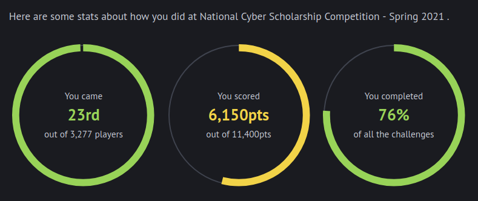

# HHousen National Cyber Scholarship Competition 2021 Writeup

Write-ups for various challenges from the 2021 [National Cyber Scholarship Competition](https://www.nationalcyberscholarship.org/). These CTF challenges were used for both [Cyber FastTrack](https://cyber-fasttrack.org/) and the[ National Cyber Scholarship Competition](https://www.nationalcyberscholarship.org/) simultaneously.

During the competition period, which was held from April 5th, 2021 12:00PM EST to April 7th, 2021 12:00PM EST, I placed **23rd out of 3,277** (**top 0.7%**) with a score of **6,150 points**. I completed **76% of the challenges** and earned **54% of the available points**.

