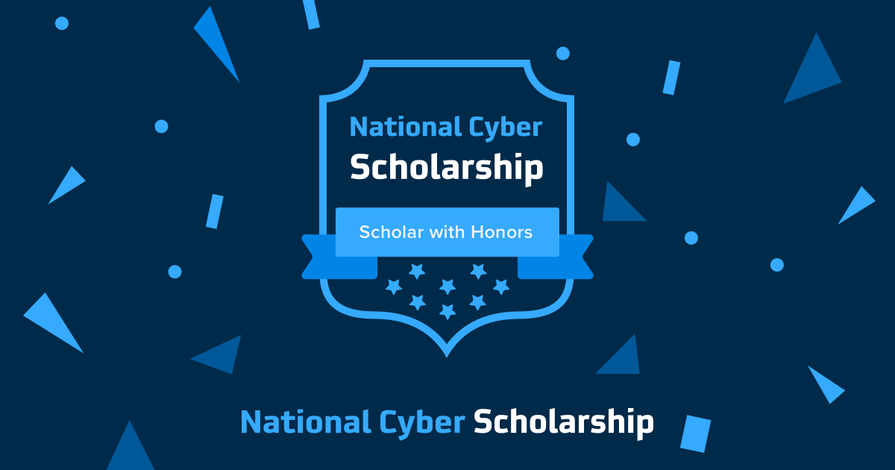

# HHousen National Cyber Scholarship Competition 2021 Writeup

Write-ups for various challenges from the 2021 [National Cyber Scholarship Competition](https://www.nationalcyberscholarship.org/). These CTF challenges were used for both [Cyber FastTrack](https://cyber-fasttrack.org/) and the [National Cyber Scholarship Competition](https://www.nationalcyberscholarship.org/) simultaneously.

**For this cybersecurity competition, I was named a [National Cyber Scholar with Honors](https://www.nationalcyberscholarship.org/winners-2021) and was awarded a $3,000 scholarship.** Scholar with Honors is the highest accolade available through the [NCS Competition](https://www.nationalcyberscholarship.org/high-school-scholarship-competition), and is awarded to the top 30 National Cyber Scholars.

During the competition period, which was held from April 5th, 2021 12:00PM EST to April 7th, 2021 12:00PM EST, I placed **23rd out of 3,277** (**top 0.7%**) with a score of **6,150 points**. I completed **76% of the challenges** and earned **54% of the available points**. Since then, I have solved every challenge and achieved the maximum score of **11,400 points**.

The leaderboard is available here: [National Cyber Scholarship Competition - Spring 2021 Leaderboard](https://leaderboard.tomahawque.com/943e22be-870a-11eb-8e55-636337383761/359e5c0b1998ff3e19014cb3b9239f64/) ([Internet Archive](https://web.archive.org/web/20210409025024/https://leaderboard.tomahawque.com/943e22be-870a-11eb-8e55-636337383761/359e5c0b1998ff3e19014cb3b9239f64/))

